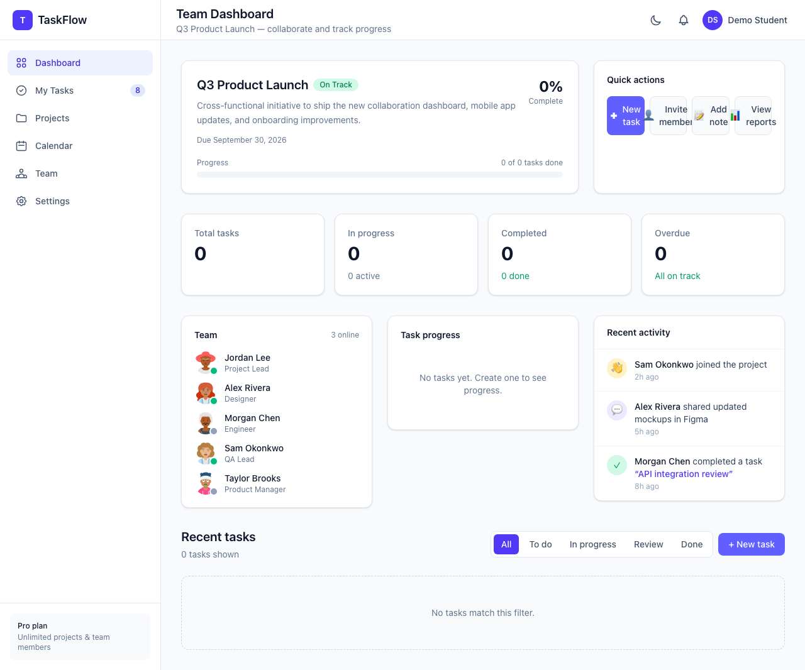

# Module 6: Hands-On Lab — AI for Frontend Development

**TaskFlow Collaboration App** — A React application built with **TypeScript**, **Vite**, and **Tailwind CSS**, demonstrating modern UI components, state management, and comprehensive **Playwright E2E testing**.

> **For course professor:** See [docs/SUBMISSION.md](docs/SUBMISSION.md) for a quick overview of all deliverables.  
> **Repository root:** [../README.md](../README.md)



## Features

| Exercise | Component / Feature | Route |
|----------|---------------------|-------|
| 1 | React + TypeScript + Vite + Tailwind setup | — |
| 2 | UserProfile component | `/demos/profile` |
| 3 | UserProfile demo page | `/demos/profile` |
| 4 | ProductCard component | `/demos/products` |
| 5 | Responsive Navbar | *(integrated in demos)* |
| 6 | Task management dashboard | `/dashboard` |
| 7 | Settings panel (tabs) | `/demos/settings` |
| 8 | Analytics dashboard | `/demos/analytics` |
| 9 | Playwright E2E tests (task workflow) | `e2e/` |
| 10 | Product search + E2E tests | `/products` |
| 11 | Team collaboration dashboard | `/dashboard` |
| 12 | Kanban board (drag-and-drop) | `/board` |

## Tech Stack

- **React 19** + **TypeScript 6**
- **Vite 8** — dev server & build
- **Tailwind CSS v4** — styling with dark mode
- **React Router v7** — client-side routing
- **Playwright** — E2E & accessibility testing
- **axe-core** — WCAG accessibility audits

## Prerequisites

- [Node.js](https://nodejs.org/) **18+** (20+ recommended)
- npm **9+**

## Setup Instructions

```bash
# From repository root
cd Module-6-AI-Frontend-Development

# 1. Install dependencies
npm install

# 2. Install Playwright browsers (first time only)
npx playwright install chromium

# 3. Start the development server
npm run dev
```

Open [http://localhost:5173](http://localhost:5173) in your browser.

### Demo credentials

Register a new account at `/register`, or use any email/password (stored in browser localStorage).

## Available Scripts

| Command | Description |
|---------|-------------|
| `npm run dev` | Start Vite dev server |
| `npm run build` | TypeScript check + production build |
| `npm run preview` | Preview production build |
| `npm run lint` | Run Oxlint |
| `npm run test:e2e` | Run all Playwright E2E tests |
| `npm run test:e2e:ci` | Run tests + generate report in `docs/` |
| `npm run screenshots` | Capture screenshots for documentation |
| `npm run test:e2e:ui` | Playwright interactive UI mode |

## Application Routes

| Route | Auth | Description |
|-------|------|-------------|
| `/login` | Guest | Sign in |
| `/register` | Guest | Create account |
| `/dashboard` | Required | Team collaboration dashboard |
| `/board` | Required | Kanban board with drag-and-drop |
| `/products` | Public | Product search with filters |
| `/demos/profile` | Public | UserProfile component showcase |
| `/demos/settings` | Public | Settings panel showcase |
| `/demos/analytics` | Public | Analytics dashboard showcase |

## Project Structure

```
src/
├── components/
│   ├── analytics/      # KPI cards, charts, data tables
│   ├── auth/           # Protected & guest routes
│   ├── common/         # UserProfile, ProductCard
│   ├── dashboard/      # Layout, task cards, modals
│   ├── kanban/         # Kanban board, columns, cards
│   ├── layout/         # Navbar, Container
│   ├── settings/       # Settings panel
│   ├── team/           # Project overview, activity feed
│   └── ui/             # Button, forms, toggles
├── context/            # Auth & task state management
├── data/               # Sample data
├── hooks/              # useTheme
├── lib/                # localStorage utilities
└── pages/              # Route pages
e2e/                    # Playwright test suites
docs/
├── SUBMISSION.md       # Quick guide for course professor
├── AI_PROMPTS.md       # AI prompts documentation
├── screenshots/        # Application screenshots (9 images)
└── test-report/        # Playwright results + HTML report
```

## Screenshots

Screenshots of the running application are in [`docs/screenshots/`](docs/screenshots/):

| Screenshot | Page |
|------------|------|
| [01-login.png](docs/screenshots/01-login.png) | Login |
| [02-register.png](docs/screenshots/02-register.png) | Registration |
| [03-user-profile-demo.png](docs/screenshots/03-user-profile-demo.png) | UserProfile demo |
| [04-analytics-dashboard.png](docs/screenshots/04-analytics-dashboard.png) | Analytics dashboard |
| [05-settings-panel.png](docs/screenshots/05-settings-panel.png) | Settings panel |
| [06-product-search.png](docs/screenshots/06-product-search.png) | Product search |
| [07-team-dashboard.png](docs/screenshots/07-team-dashboard.png) | Team dashboard |
| [08-kanban-board.png](docs/screenshots/08-kanban-board.png) | Kanban board |
| [09-dashboard-dark-mode.png](docs/screenshots/09-dashboard-dark-mode.png) | Dark mode |

Regenerate screenshots:

```bash
npm run screenshots
```

## Test Report

Playwright E2E test results are in [`docs/test-report/TEST_REPORT.md`](docs/test-report/TEST_REPORT.md).

Open the interactive HTML report: `docs/test-report/html/index.html`

Run tests and regenerate the report:

```bash
npm run test:e2e:ci
```

### Test suites

- **task-workflow.spec.ts** — Registration, login, task CRUD, logout
- **accessibility.spec.ts** — WCAG 2A/2AA, keyboard navigation
- **responsive.spec.ts** — Mobile, tablet, desktop layouts
- **error-handling.spec.ts** — Validation and error states
- **product-search.spec.ts** — Search, filters, pagination

## AI Prompts

A detailed log of AI prompts used for each exercise is in [`docs/AI_PROMPTS.md`](docs/AI_PROMPTS.md).

## State Management

- **AuthContext** — User session (register, login, logout) via localStorage
- **TaskContext** — Tasks CRUD + activity feed logging
- **useTheme** — Light/dark mode with persistence

## License

This project was created for educational purposes as part of the Cursor AI Course.
