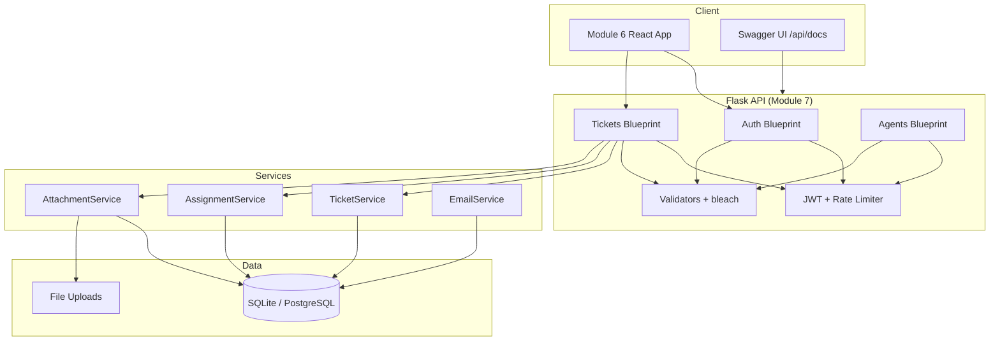
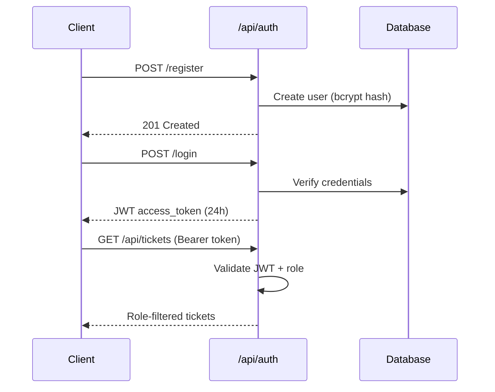

# Module 7 — Backend Architecture

Customer Support Ticket System API built with Flask.

## System Overview



## Layer Structure

```
Module-7-AI-Backend-Development/
├── app/
│   ├── __init__.py          # Application factory
│   ├── config.py            # Config classes
│   ├── extensions.py        # db, jwt, ma, limiter, api
│   ├── models/              # SQLAlchemy models
│   ├── schemas/             # Marshmallow schemas
│   ├── resources/           # API blueprints (routes)
│   ├── services/            # Business logic
│   └── utils/               # Security, permissions, errors
├── tests/                   # pytest suite (28 tests)
├── run.py                   # Entry point
└── Dockerfile               # Production container
```

## Authentication Flow



## CI Integration

| Job | Workflow | Command |
|-----|----------|---------|
| `test-backend` | `fullstack-ci.yml` | `pytest -n auto --dist loadgroup` |
| `docker-backend` | `fullstack-ci.yml` | Docker build + `/health` check |
| `security` (bandit) | `fullstack-ci.yml` | Bandit + pip-audit |

← [Back to submission guide](SUBMISSION.md)
