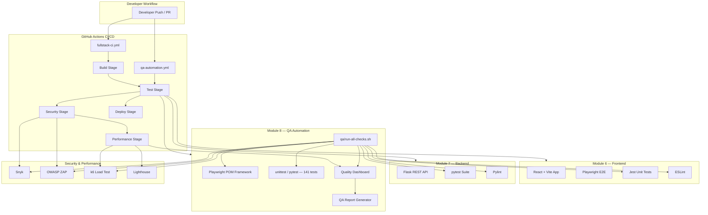
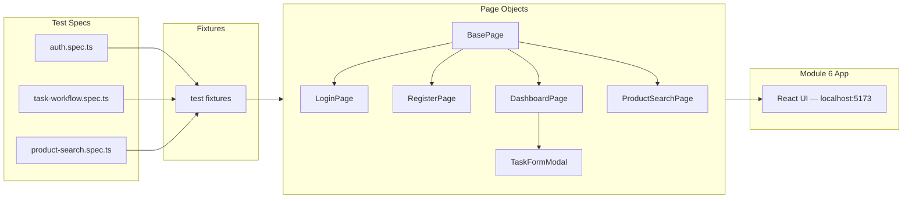
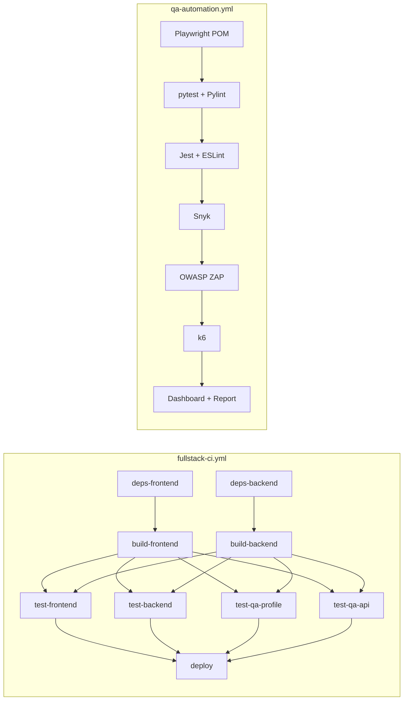
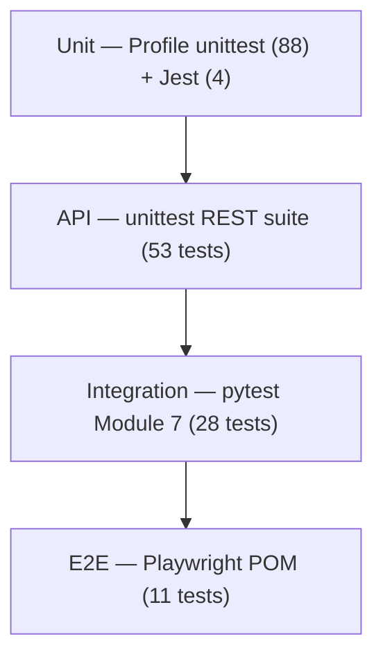
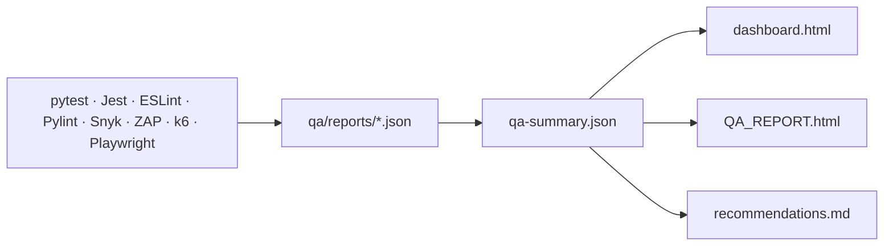

# Module 8 — QA & DevOps Architecture

System architecture for the full-stack QA automation platform spanning Module 6 (frontend), Module 7 (backend), and Module 8 (QA/DevOps).

## High-Level Architecture

## QA Automation Framework (Page Object Model)

## CI/CD Pipeline Stages

## Test Pyramid

## Report Data Flow

## Module Integration

| Module | Role | Key Paths |
|--------|------|-----------|
| Module 6 | Frontend under test | `Module-6-AI-Frontend-Development/` |
| Module 7 | Backend API under test | `Module-7-AI-Backend-Development/` |
| Module 8 | QA orchestration & CI | `Module-8-AI-QA-DevOps/` |

## Workflows

| Workflow | File | Purpose |
|----------|------|---------|
| Full-stack CI/CD | [`.github/workflows/fullstack-ci.yml`](../../.github/workflows/fullstack-ci.yml) | Build, test, deploy |
| QA Automation | [`.github/workflows/qa-automation.yml`](../../.github/workflows/qa-automation.yml) | Full QA suite + dashboard |

← [Back to submission guide](SUBMISSION.md)
